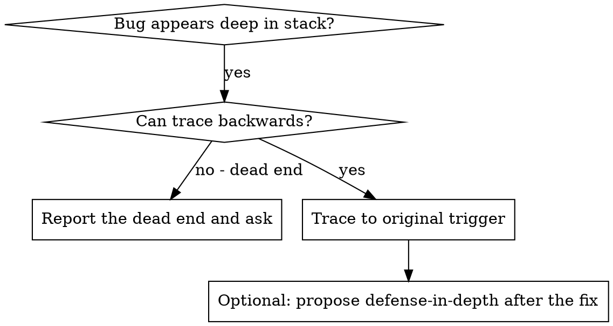
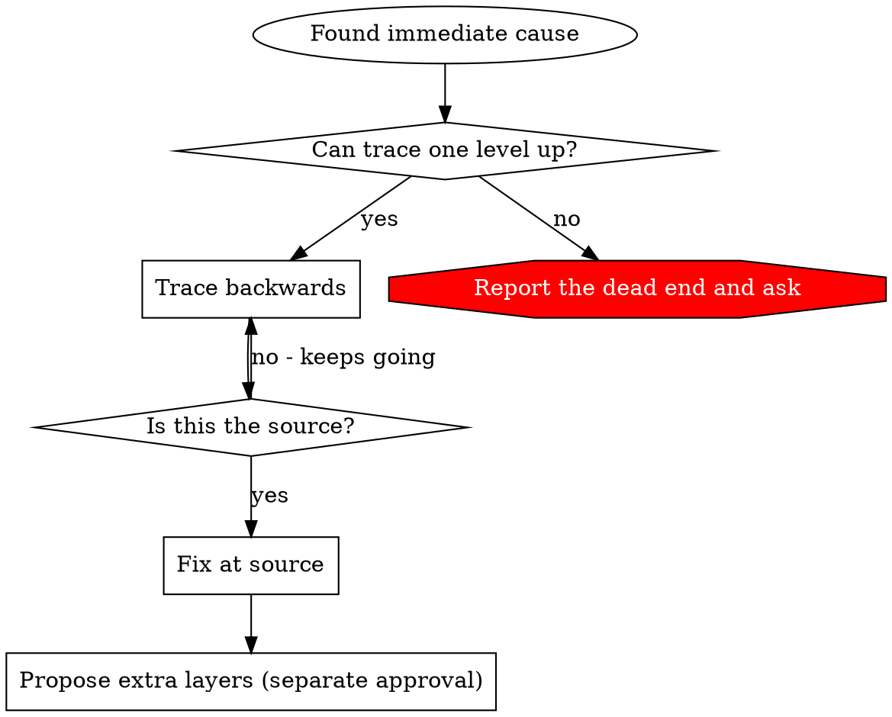

# Root Cause Tracing

## Overview

Bugs often manifest deep in the call stack (git init in wrong directory, file created in wrong location, database opened with wrong path). Your instinct is to fix where the error appears, but that's treating a symptom.

**Core principle:** Trace backward through the call chain until you find the original trigger, then fix at the source.

## When to Use



**Use when:**
- Error happens deep in execution (not at entry point)
- Stack trace shows long call chain
- Unclear where invalid data originated
- Need to find which test/code triggers the problem

## Find the Failing Boundary

When the system has several components (CI → build → signing, API → service →
database), instrument each component boundary before proposing fixes:

- what data enters and exits the component
- whether environment and config propagate
- the state at each layer

Run once to see WHERE it breaks. Analyze that evidence to find the failing
component, then investigate only that component.

Print presence and shape, never values, and tag every line for cleanup:

```bash
# Layer 1: workflow step
printf '[DEBUG-a4f2] workflow: signing key set=%s\n' "${SIGNING_KEY:+yes}"
# Layer 2: build script
printf '[DEBUG-a4f2] build: signing key set=%s\n' "${SIGNING_KEY:+yes}"
printf '[DEBUG-a4f2] build: artifact present=%s\n' "$(test -f "$ARTIFACT_PATH" && printf yes)"
# Layer 3: signing script
printf '[DEBUG-a4f2] signing: signing key set=%s\n' "${SIGNING_KEY:+yes}"
# Never print credentials or complete process environments.
```

An empty field means absent. The first layer where a field turns empty is the
broken boundary: `set=yes` in the workflow but `set=` in the build means the
secret does not reach the build step.

## The Tracing Process

### 1. Observe the Symptom
```
Error: git init failed in ~/project/packages/core
```

### 2. Find Immediate Cause
**What code directly causes this?**
```typescript
await execFileAsync('git', ['init'], { cwd: projectDir });
```

### 3. Ask: What Called This?
```typescript
WorktreeManager.createSessionWorktree(projectDir, sessionId)
  → called by Session.initializeWorkspace()
  → called by Session.create()
  → called by test at Project.create()
```

### 4. Keep Tracing Up
**What value was passed?**
- `projectDir = ''` (empty string!)
- Empty string as `cwd` resolves to `process.cwd()`
- That's the source code directory!

### 5. Find Original Trigger
**Where did empty string come from?**
```typescript
const context = setupCoreTest(); // Returns { tempDir: '' }
Project.create('name', context.tempDir); // Accessed before beforeEach!
```

## Adding Stack Traces

When you can't trace manually, add instrumentation:

```typescript
// Before the problematic operation
async function gitInit(directory: string) {
  const stack = new Error().stack;
  console.error('[DEBUG-a4f2] git init:', {
    directory,
    cwd: process.cwd(),
    nodeEnvConfigured: Object.hasOwn(process.env, 'NODE_ENV'),
    stack,
  });

  await execFileAsync('git', ['init'], { cwd: directory });
}
```

**Critical:** Use `console.error()` in tests (not logger - may not show)

**Run and capture:**
```bash
npm test 2>&1 | grep -F '[DEBUG-a4f2]'
```

**Analyze stack traces:**
- Look for test file names
- Find the line number triggering the call
- Identify the pattern (same test? same parameter?)

## Finding Which Test Causes Pollution

If something appears during tests but you don't know which test, use the
bisection script `find-polluter.sh` in this skill directory. Run it from the
project root. The checked path must not already exist; an existing path is
pre-existing pollution and the script refuses to guess.

```bash
bash <skill-dir>/find-polluter.sh 'packages/core/.git' 'packages/core/src/**/*.test.ts'
```

It runs tests one by one and stops at the first polluter. A package-manager
runner is called as `<runner> test -- <file>`; any other runner is an
executable path called as `<runner> <file>`. Confirm by hand that one runner
call executes a single test file before you trust the result.

## Real Example: Empty projectDir

**Symptom:** `.git` created in `packages/core/` (source code)

**Trace chain:**
1. `git init` runs in `process.cwd()` ← empty cwd parameter
2. WorktreeManager called with empty projectDir
3. Session.create() passed empty string
4. Test accessed `context.tempDir` before beforeEach
5. setupCoreTest() returns `{ tempDir: '' }` initially

**Root cause:** Top-level variable initialization accessing empty value

**Fix:** Made tempDir a getter that throws if accessed before beforeEach

**Then proposed defense-in-depth as a separate change** (see
`defense-in-depth.md`), added only after approval.

## Key Principle



**NEVER fix just where the error appears.** Trace back to find the original
trigger. At a dead end, report what you traced and ask your human partner; do
not silently fix at the symptom.

## Stack Trace Tips

**In tests:** Use `console.error()` not logger - logger may be suppressed
**Before operation:** Log before the dangerous operation, not after it fails
**Include context:** Directory, cwd, timestamps, and only the names or presence of
explicitly allowlisted configuration keys. Redact every value; never dump the
environment.
**Capture stack:** `new Error().stack` shows complete call chain
**Tag it:** Use one `[DEBUG-...]` prefix so cleanup is a single grep
